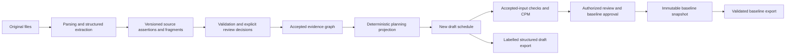

# Evidence-driven planning architecture

## Material findings

The prior system mixed extraction, canonical deliverable matching and planning.
Some paths merged similar titles, reused values from unrelated source revisions,
ranked conflicting facts by confidence, and supplied calendar or duration
defaults. Source-backed dates and calculated dates were not consistently separated.
The existing approval UI did not provide a persistent, property-level knowledge
review boundary. Export formats had different validation and provenance coverage.

## Implemented flow

Extraction does not create accepted schedule logic. A quoted value is a candidate
until validated and reviewed. Missing values remain missing. An explicit empty
predecessor list is a recorded independence decision; it is not equivalent to an
empty extraction result.

The graph uses the existing PostgreSQL database, not a separate graph service.
It preserves document versions, original-file SHA-256, extracted-text SHA-256,
verbatim fragments, locators, assertions, relationships and append-only decisions.
Original file storage is retained; the graph does not rewrite uploaded bytes.
Source checksums are distinguished from hashes of extracted text.

Facts and entities have deterministic, project- and source-version-scoped IDs.
Duplicate names and repeated identifiers remain distinct. Identity links require
a project-authorized decision and do not merge source records or select a winner
when linked values conflict. A register is primary deliverable scope; unresolved
register-to-activity associations block accepted planning output.

## Review and provenance

`EvidenceGraph`, `EvidenceDocumentVersion`, `EvidenceNode`, `EvidenceEdge` and
`EvidenceDecision` persist knowledge separately from schedule output. Source
values are not overwritten by corrections. A correction creates an accepted
planning-input fact with actor, reason, graph revision and a `supersedes` edge.
Calculation and identity projection rules carry explicit versions and reference
their accepted input facts. Confidence never grants acceptance.

Accepted facts use document evidence, approved planning input or deterministic
derivation provenance. Unreviewed legacy inputs have no accepted provenance type.
Confidence metadata separately describes extraction calibration, evidence
location and human review. Unknown scores remain unknown, not probabilities.

The UI provides a paginated queue of missing inputs and conflicts, source excerpts
and locations, side-by-side comparison, accept/reject/correct/link decisions and
typed duration, calendar, relationship and constraint editors. All decisions
require a reason. Project viewers cannot mutate the graph merely because they
have module-level update permission. Historical schedule views remain read-only.

Readiness is evaluated over the complete graph, not just the visible queue page.
Source/planning changes make the graph stale. Refresh preserves previous evidence
and decisions while invalidating affected source-version associations. Exact
unchanged assertions and their correction chains can be reused; unchanged
processing does not create duplicate nodes or schedules.

## API commands

All routes are under `/api/v1/planning-intelligence/projects/{project_id}/` and
respect project isolation and module permissions.

| Route | Purpose |
| --- | --- |
| `GET evidence-review/` | Readiness, paginated issues, relevant facts and recent decisions; no writes. |
| `POST evidence-review/refresh/` | Explicit, idempotent graph construction from current source versions. |
| `POST evidence-review/decisions/` | Revision-guarded accept/reject/correct/link with a required reason. |
| `GET evidence-review/accepted-plan/` | Reproducible partial or ready planning projection with property provenance. |
| `POST evidence-review/materialize/` | Idempotently create a separate unapproved schedule from complete accepted inputs. |

Review pagination accepts `offset`, `limit` (maximum 200), and optional `fact_id`
for exact navigation. Creating a schedule does not calculate dates, approve a
baseline or overwrite the existing planning canvas. Existing schedule calculation
and approval endpoints retain their role, assurance and review controls.

## Calculation and baseline boundaries

`ScheduleVersion.evidence_graph`, its graph revision and frozen input snapshot
record a durable projection boundary. Removing editable activity metadata cannot
turn an evidence-driven projection into an unrestricted legacy schedule.

Before calculation, the persisted activity set and every supported material
property must match accepted knowledge. Deleting an accepted activity, adding a
duplicate, modifying its duration or changing a dependency invalidates readiness.
Cycles and dangling references are rejected. Calendars, date constraints,
explicit independence and units require accepted inputs.

The currently implemented adapter supports whole working-day durations and lags,
one assigned working calendar and at most one supported date constraint per
activity. Unsupported fractional-day, mixed-calendar, multiple-constraint and
level-of-effort semantics are reported, not rounded or approximated. The
registered project finish must match the approved planning input; projection
does not change the registered dates automatically. Infeasible networks retain
honest timing warnings and negative float rather than extending the project.

Calculation manifests bind source versions, graph decisions, rules, calendars,
exceptions, activity values and relationships. Changes invalidate cached jobs and
approval eligibility. Baselines require existing authorized approval and contain
the frozen inputs and exact calculated outputs. New revisions create new records.
PostgreSQL triggers protect source assertions, document snapshots, decisions and
approved baselines against bulk-update bypasses. Baseline exports use frozen
identity and input data rather than current project names or calendars.

## Migration and compatibility

Apply, in order, the planning migrations:

- `0033_document_extraction_coverage` (existing preceding upgrade).
- `0034_evidence_graph`: additive graph tables and indexes.
- `0035_evidence_immutability`: PostgreSQL write-protection triggers.
- `0036_schedule_evidence_projection`: nullable source-graph fields on versions.

No migration reconstructs facts, accepts inputs or rewrites project schedules.
Refresh evidence is an explicit user action. Existing source files, projects,
employee assignments and historical baselines remain intact. Old unversioned or
title-associated evidence may now require an explicit identity review.

Existing manual/legacy integrations retain their supported behavior and are
identified as legacy. They are not retrospectively declared evidence-verified.
Old baselines lacking a full manifest report that limitation; missing history is
not reconstructed. The new strict path is used by document-driven generations
and graph projections, including revisions retaining their source ancestry.

## Verified exports and remaining capabilities

See [export boundary details](planning-export-boundaries.md). RADAI JSON and Excel
provide structured drafts and frozen baseline outputs with traceability. CSV is
an explicitly limited activity-table export. Legacy XER is unvalidated and is
rejected for evidence-driven schedules/baselines. Primavera XML and Microsoft
Project XML adapters are unavailable. No native-tool interoperability is claimed.

The architecture upgrade does **not** establish universal document understanding.
Supported table/structured adapters, OCR and AI extraction retain coverage and
review limitations. Unrecognized layouts, images, arbitrary contractual semantics
and uncalibrated AI results are review inputs, not accepted obligations. Typed
planning contracts currently cover identity, duration/units, dates, calendars,
activity/milestone type, relationships and supported date constraints. Additional
specialized procurement, commissioning, approval-cycle and contractual fact types
need dedicated semantic validators and verified adapters before automation.

Large source sets use paginated review, but graph construction itself is currently
a synchronous command; a queued construction worker and performance validation on
representative enterprise-scale corpora remain required. Exact source locators
are retained where available; this UI opens the source and shows its locator but
does not guarantee pixel/cell highlighting in every source format.

Graph links do not retroactively transfer values into the legacy source-timing
adapter. The accepted planning projection consumes recorded facts; existing
legacy schedules require an explicit reconciliation before benefiting from those
links. No automatic cross-document workflow expansion is certified by this work.

## Validation

Regression coverage includes different table layouts, distinct similar names,
conflicts, missing values, explicit dependency semantics, source revision impact,
idempotency, read/write isolation, immutable snapshots, deterministic accepted
projections, calculation reproducibility and supported export data preservation.
Backend checks run against a disposable PostgreSQL database with real migrations.
Frontend checks cover the review API contract, accessibility, typed decisions,
readiness, explicit materialization and preserved existing schedule behavior.
Concrete run counts and local migration results are recorded in the completion
artifact; this document does not turn test coverage into an accuracy guarantee.
